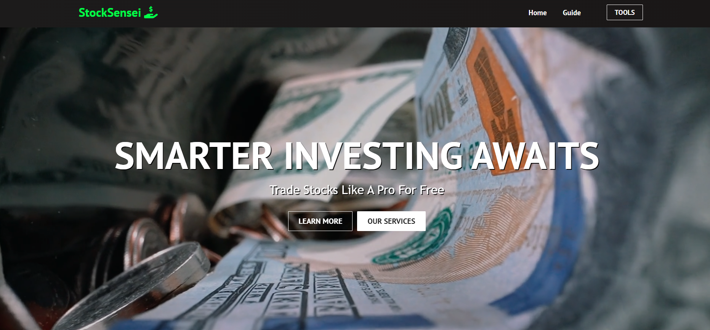
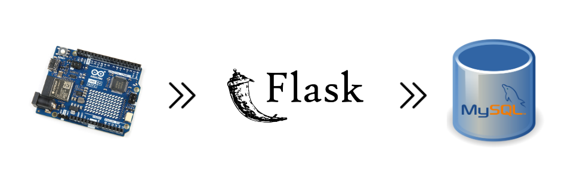

## StockSensei
StockSensei is a web-based stock analysis platform designed to assist traders in making informed decisions. The app features tools like a stock price predictor using machine learning and a technical analysis tool for comparing moving averages.
- 
- Tags: Category 1
- Badges:
  - React [blue]
  - JS [yellow]
  - Python [green]
  - Flask [orange]
  - Yahoo Finance API [purple]
  - Azure [blue]
- Buttons:
  - Live Website [https://stocksensei-h8ccbsbxbga8eaa5.westus-01.azurewebsites.net/]
  - GitHub [https://github.com/ryand4/stock_option_sim]

## Automated Data Collection and Monitoring System
As the tech lead for a university club project, I led the development of an automated data collection and monitoring system for industrial machines. The system utilized Arduino microcontrollers to record machine status codes and unit production counts, and Python Flask to send this data to a MySQL database for analysis. The solution employed RFID tags to capture real-time data, ensuring accurate monitoring of machine performance. My role involved overseeing system integration, troubleshooting data flow issues, and ensuring the project met the required technical standards.
- 
- Tags: Category 2
- Badges:
  - Arduino [blue]
  - C++ [red]
  - Python [green]
  - Flask [yellow]
  - MySQL [orange]
  - RFID [purple]
  - LCD Display [teal]
  - API [red]

